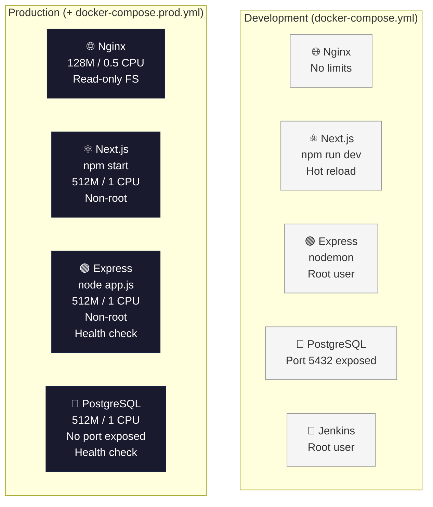

# 🚀 Production Docker Setup — Finance Tracker

## Kenapa Setup Prod Ini Penting Sebelum AWS?

> [!IMPORTANT]
> Deploy ke AWS **tanpa production-hardened Docker setup** = membangun rumah di atas pasir. Masalah yang kamu hadapi nanti di AWS akan **10x lebih susah di-debug** kalau fondasi Docker-nya belum solid.

### Analogi Sederhana

```
Development Docker   →   "Motor tanpa helm di kampung"     → Kalau jatuh, cuma lecet
Production Docker    →   "Motor berhelm di jalan tol"      → Safety first, speed tetap
AWS tanpa Prod Setup →   "Motor tanpa helm di jalan tol"   → 💀
```

### 5 Alasan Kritis

| # | Alasan | Tanpa Prod Setup | Dengan Prod Setup |
|---|--------|-----------------|-------------------|
| 1 | **Resource Exhaustion** | Satu container bisa makan semua RAM → semua service crash | Memory limit 512M → container di-kill kalau bocor, service lain aman |
| 2 | **Disk Penuh** | Log terus menulis tanpa batas → disk EC2 penuh → SSH pun gagal | Log rotasi otomatis: max 20MB × 5 files = max 100MB per service |
| 3 | **Service Mati Diam-diam** | Container running tapi app freeze → user lihat blank page | Health check setiap 30 detik → auto-restart jika gagal |
| 4 | **Security Breach** | Container jalan sebagai root → jika di-hack, attacker kontrol penuh | Non-root user → blast radius minimal |
| 5 | **AWS Cost Overrun** | Tidak tahu berapa resource yang dibutuhkan → oversized EC2 instance | Resource limits memberi data konkret untuk sizing EC2/ECS |

> [!TIP]
> Dengan setup prod ini, kamu tahu bahwa seluruh stack butuh **max ~1.6GB RAM** (512M×3 + 128M nginx). Artinya di AWS, cukup pakai **t3.small** (2GB RAM) untuk mulai — hemat **~$15/bulan** dibanding langsung pakai t3.medium.

---

## 📁 File Yang Dibuat

| File | Fungsi |
|------|--------|
| [docker-compose.prod.yml](file:///Users/andrel/finance-tracker/docker-compose.prod.yml) | Override compose untuk production |
| [backend/Dockerfile.prod](file:///Users/andrel/finance-tracker/backend/Dockerfile.prod) | Multi-stage build, non-root user, dumb-init |
| [frontend/Dockerfile.prod](file:///Users/andrel/finance-tracker/frontend/Dockerfile.prod) | 3-stage build (deps → build → runner) |
| [.env.production.example](file:///Users/andrel/finance-tracker/.env.production.example) | Template env production (tanpa secrets) |
| [.gitignore](file:///Users/andrel/finance-tracker/.gitignore) | Updated: `.env.production` ditambahkan |

### Cara Pakai

```bash
# Development (seperti biasa)
docker-compose up -d --build

# Production (overlay/override)
docker-compose -f docker-compose.yml -f docker-compose.prod.yml up -d --build

# Production dengan env file terpisah
docker-compose -f docker-compose.yml -f docker-compose.prod.yml --env-file .env.production up -d --build
```

---

## 🔑 Keputusan Desain docker-compose.prod.yml

### 1. Resource Limits

```yaml
deploy:
  resources:
    limits:
      cpus: "1.00"
      memory: 512M      # Hard limit → container di-OOM-kill jika melebihi
    reservations:
      cpus: "0.25"
      memory: 128M      # Guaranteed minimum
```

**Kenapa `limits` DAN `reservations`?**
- **limits** = "kamu tidak boleh pakai lebih dari ini" → mencegah satu container membunuh yang lain
- **reservations** = "kamu dijamin dapat minimal segini" → Docker scheduler tahu berapa kapasitas host

### 2. Logging dengan Rotasi

```yaml
logging:
  driver: json-file
  options:
    max-size: "20m"    # Rotasi setiap 20MB
    max-file: "5"      # Simpan 5 file terakhir
```

**Kenapa bukan `syslog` atau `fluentd`?**
- `json-file` = default Docker, tidak butuh infrastructure tambahan
- Di AWS nanti, bisa upgrade ke `awslogs` driver yang push langsung ke CloudWatch
- **Max disk usage per service: 100MB** (20MB × 5 files) — predictable

### 3. Health Checks

```yaml
healthcheck:
  test: ["CMD-SHELL", "wget --spider http://localhost:3011/api/health || exit 1"]
  interval: 30s       # Cek setiap 30 detik
  timeout: 10s        # Timeout per check
  retries: 3          # 3× gagal berturut-turut = unhealthy
  start_period: 40s   # Grace period saat startup (jangan cek selama 40 detik pertama)
```

**Kenapa `wget` bukan `curl`?**
- Alpine image tidak punya `curl` by default, tapi `wget` bisa di-install lebih kecil
- Alternative: install `curl` (~5MB) vs `wget` yang lebih ringan

### 4. Jenkins Dipisah via Profiles

```yaml
jenkins:
  profiles:
    - ci  # Hanya aktif jika: docker compose --profile ci up
```

**Rationale:** Jenkins tidak boleh jalan di server production yang sama. Di production, Jenkins seharusnya di server CI/CD terpisah. Profile memastikan Jenkins tidak ikut start saat `docker-compose up`.

---

## 🔒 Security Checklist

### ✅ Yang Sudah Diimplementasi

| # | Item | Status | Implementasi |
|---|------|--------|-------------|
| 1 | **Non-root container user** | ✅ Done | `USER appuser` (UID 1001) di Dockerfile.prod |
| 2 | **No secrets in compose file** | ✅ Done | Semua credentials via `${ENV_VAR}` dari `.env` |
| 3 | **Read-only root filesystem** | ✅ Done | `read_only: true` + `tmpfs` untuk writable dirs |
| 4 | **DB tidak di-expose ke host** | ✅ Done | `ports: !override []` di prod compose |
| 5 | **Multi-stage Docker build** | ✅ Done | Source code + devDependencies tidak ada di final image |
| 6 | **Signal handling (PID 1)** | ✅ Done | `dumb-init` sebagai entrypoint |
| 7 | **Production env template** | ✅ Done | `.env.production.example` (tanpa nilai asli) |
| 8 | **Gitignore prod env** | ✅ Done | `.env.production` masuk `.gitignore` |
| 9 | **No `npm run dev` in prod** | ✅ Done | `CMD ["node", "app.js"]` / `next start` |
| 10 | **Log rotation** | ✅ Done | `max-size: 20m, max-file: 5` |

### ⚠️ TODO Sebelum Deploy ke AWS

| # | Item | Priority | Cara |
|---|------|----------|------|
| 1 | **Ganti semua default passwords** | 🔴 Critical | `openssl rand -base64 32` untuk generate |
| 2 | **CORS origin → domain production** | 🔴 Critical | Ubah `app.js` line 27: `origin: ['https://yourdomain.com']` |
| 3 | **SSL/TLS termination** | 🔴 Critical | ALB di AWS atau Certbot di nginx |
| 4 | **Rate limiting** | 🟡 High | `npm install express-rate-limit` → apply ke semua routes |
| 5 | **Helmet.js headers** | 🟡 High | `npm install helmet` → `app.use(helmet())` |
| 6 | **Database backup** | 🟡 High | AWS RDS auto-backup atau `pg_dump` cron |
| 7 | **Docker image scanning** | 🟢 Medium | `docker scout` atau Snyk |
| 8 | **Secrets management** | 🟢 Medium | AWS SSM Parameter Store / Secrets Manager |
| 9 | **CSRF secure cookie** | ✅ Already | `secure: process.env.NODE_ENV === 'production'` (sudah ada di app.js) |

### Penjelasan: Kenapa Non-Root User Penting?

```
Skenario: Attacker menemukan RCE (Remote Code Execution) vulnerability di Express

Container ROOT user:
  → Attacker mendapat akses root dalam container
  → Bisa baca /etc/shadow, install tools, pivoting ke host
  → Container escape exploit → FULL CONTROL server

Container NON-ROOT user (appuser):
  → Attacker mendapat akses sebagai appuser
  → Tidak bisa install packages, baca system files
  → Read-only filesystem → tidak bisa drop malware
  → Blast radius = hanya bisa baca source code aplikasi
```

---

## ✍️ Draft Artikel #3: "How I Solved the Docker-to-Production Gap"

> [!NOTE]
> Ini draft yang bisa kamu polish. Format: "How I Solved X" — technical blog post style. Tantangan yang dipilih: **menjembatani gap antara Docker development yang "works on my machine" ke production-ready container setup.**

---

### Title: How I Solved the Docker-to-Production Gap in My Finance Tracker App

### Hook (Opening)

*"My `docker-compose up` worked perfectly on localhost. Then I tried deploying to a real server, and everything fell apart within 48 hours."*

That was my reality in Q1 2026. My Finance Tracker — a full-stack app with Next.js, Express, PostgreSQL, and Nginx — ran beautifully in development. But the moment I started thinking about AWS deployment, I realized my Docker setup was a ticking time bomb.

### The Problem

My development Docker setup had **5 hidden production killers**:

1. **Containers running as root** — one vulnerability away from full server compromise
2. **No resource limits** — a memory leak in Express could starve PostgreSQL to death
3. **Unbounded logging** — `console.log` in a loop could fill a 20GB disk in hours
4. **`npm run dev` in production** — nodemon watching files, Next.js hot-reload, sourcemaps exposed
5. **No health checks** — if the API hung (not crashed), Docker thought everything was fine

I didn't discover these issues by reading docs. I discovered them by asking: *"What happens if this runs for 30 days straight without anyone touching it?"*

### The Solution: Separation of Concerns

Instead of modifying my working `docker-compose.yml`, I created a **production overlay file** (`docker-compose.prod.yml`) that overrides only what needs to change:

```bash
# Dev:  the compose file I already trust
docker-compose up -d

# Prod: same base + production hardening
docker-compose -f docker-compose.yml -f docker-compose.prod.yml up -d
```

This approach gave me **zero risk of breaking development** while adding production safety.

#### Key Decisions:

**1. Multi-Stage Dockerfiles**
```dockerfile
# Stage 1: Install deps (cached)
FROM node:20-alpine AS deps
RUN npm ci --omit=dev        # No devDependencies

# Stage 2: Final image
FROM node:20-alpine AS runner
USER appuser                  # Non-root
CMD ["node", "app.js"]        # No nodemon
```
Result: Image size dropped from **~250MB to ~120MB**. Attack surface reduced by eliminating build tools.

**2. Resource Limits as Documentation**
```yaml
deploy:
  resources:
    limits:
      memory: 512M            # "This service needs at most 512MB"
```
This wasn't just about safety — it became **living documentation** for AWS instance sizing. I now know my entire stack needs ~1.6GB, which means a `t3.small` is sufficient to start.

**3. The Health Check That Saved Me**

I added a health check that hits my `/api/health` endpoint:
```yaml
healthcheck:
  test: ["CMD-SHELL", "wget --spider http://localhost:3011/api/health || exit 1"]
  interval: 30s
  retries: 3
```

This endpoint doesn't just return 200 — it queries the database. So if the DB connection pool is exhausted, the health check fails, and Docker restarts the container. This is the **single best investment** I made.

### What I Learned

| Lesson | Before | After |
|--------|--------|-------|
| Docker ≠ Production-ready | "It runs in Docker, so it's safe" | Docker is a packaging tool, not a security tool |
| Dev and Prod are different worlds | Same Dockerfile, same compose | Separate Dockerfiles, overlay compose |
| Resource limits = cost planning | "I'll figure out AWS sizing later" | I know exactly: t3.small (2GB) is enough |
| Logging is infrastructure | `console.log` everywhere | Structured logging with rotation |

### The Hardest Part

The hardest part wasn't technical — it was **accepting that my working setup was inadequate**. When your app runs perfectly with `docker-compose up`, it feels wasteful to spend 2 days hardening it. But every hour I invested in production setup will save me **days of debugging** on AWS.

### What's Next

With this production Docker setup validated, I'm ready for the next phase: **deploying to AWS**. The resource limits in my compose file will directly map to ECS task definitions, and the health checks will plug into ALB target groups.

The foundation is solid. Time to build on it.

---

*This is Part 3 of my series on building a production-grade Finance Tracker. Previously: [Part 1: Building the API], [Part 2: Docker Compose & CI/CD].*

---

## 🗺️ Arsitektur: Dev vs Production



---

## ⚡ Perintah Quick Reference

```bash
# ─── Validate compose config ───
docker-compose -f docker-compose.yml -f docker-compose.prod.yml config

# ─── Build & Run Production ───
docker-compose -f docker-compose.yml -f docker-compose.prod.yml --env-file .env.production up -d --build

# ─── Check health status ───
docker inspect --format='{{.State.Health.Status}}' express_api
docker inspect --format='{{.State.Health.Status}}' postgres_db

# ─── Check resource usage ───
docker stats --no-stream

# ─── View logs (dengan rotasi) ───
docker-compose -f docker-compose.yml -f docker-compose.prod.yml logs -f --tail=100 backend

# ─── Stop production ───
docker-compose -f docker-compose.yml -f docker-compose.prod.yml down
```
